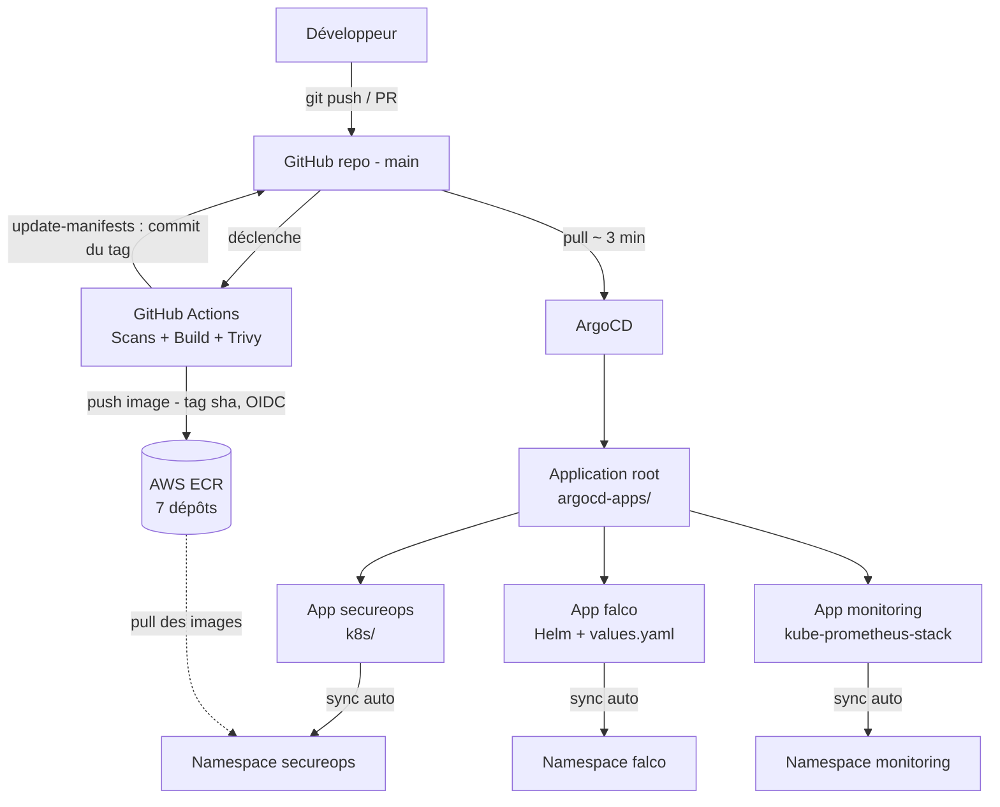
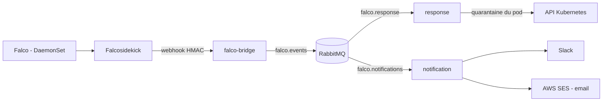

# 🔐 SecureOps

Plateforme DevSecOps déployée sur AWS : une application SaaS d'analyse de sécurité du code, un pipeline CI/CD sécurisé, du GitOps avec ArgoCD et une réponse automatique aux menaces sur Kubernetes.

> Projet portfolio réalisé en 4 mois, déployé sur une infrastructure AWS réelle (EKS, RDS, ECR, Secrets Manager).


## ✨ Fonctionnalités

La plateforme permet de :

- connecter un dépôt GitHub ;
- analyser automatiquement le code et la configuration ;
- détecter des vulnérabilités et des mauvaises configurations ;
- générer un **score de sécurité DevSecOps** ;
- visualiser les résultats dans un **dashboard React**.

Côté plateforme :

- **Infrastructure as Code** complète avec Terraform, scannée par Checkov ;
- **CI/CD sécurisé** : SAST, détection de secrets, scan d'images bloquant ;
- **GitOps** avec ArgoCD (pattern App-of-Apps) ;
- **Détection et réponse automatisée** aux menaces runtime avec Falco ;
- **Notifications** Slack et email (SES) ;
- **Observabilité** avec Prometheus et Grafana.

## 🏗️ Architecture

### Flux GitOps



### Détection et réponse aux menaces



Lors d'une alerte critique, le pod est **mis en quarantaine** : retrait du label applicatif (il sort du Service) et application d'une NetworkPolicy `deny-all`. Le pod n'est jamais supprimé, ce qui préserve les preuves pour l'investigation forensique, pendant que le Deployment recrée un pod sain.

## 🧩 Composants

### Microservices (namespace `secureops`)

| Service | Rôle |
|---|---|
| `dashboard` | Interface React |
| `auth` | Authentification JWT, équipes par organisation (multi-tenant) |
| `scan-api` | API de lancement et de consultation des scans |
| `worker` | Exécute les analyses (Semgrep, Gitleaks, Checkov, Trivy) et calcule le score de risque |
| `falco-bridge` | Reçoit les alertes Falco et les publie dans RabbitMQ |
| `response` | Met en quarantaine les pods compromis |
| `notification` | Envoie les alertes Slack et email (SES) |
| `rabbitmq` | Bus de messages (files `scan_requests`, `falco.events`, `falco.response`, `falco.notifications`, `falco.dead-letter`) |

### Infrastructure (AWS, `us-east-1`)

- **Réseau** : VPC, sous-réseaux publics et privés, NAT Gateway, ALB (via AWS Load Balancer Controller)
- **Calcul** : cluster EKS, node group managé
- **Données** : RDS PostgreSQL 16 chiffré, dans des sous-réseaux dédiés
- **Images** : ECR (7 dépôts)
- **Secrets** : AWS Secrets Manager
- **Logs** : CloudWatch (control plane EKS)

### Composants du cluster (installés avec Helm)

| Composant | Rôle |
|---|---|
| ArgoCD | Déploiement continu GitOps |
| External Secrets Operator (ESO) | Synchronise Secrets Manager vers les Secrets Kubernetes |
| AWS Load Balancer Controller | Crée l'ALB à partir de l'Ingress |
| Descheduler | Rééquilibre les pods entre les nœuds |
| Falco + Falcosidekick | Détection runtime et routage des alertes |
| kube-prometheus-stack | Prometheus et Grafana |

## 🔄 Pipeline CI/CD

À chaque push, le workflow `.github/workflows/ci.yaml` exécute :

1. **Scans en parallèle** : Semgrep (SAST), Gitleaks (secrets), Bandit (Python), Checkov (Terraform) ;
2. **Build des 7 images** Docker, chacune scannée par **Trivy** (bloquant sur les vulnérabilités CRITICAL corrigeables) ;
3. **Push vers ECR** (tag = sha du commit), uniquement sur `main` ;
4. **`update-manifests`** : le pipeline remplace le tag d'image dans `k8s/`, puis commit et push.

ArgoCD détecte ce commit et déploie la nouvelle version. Chaque déploiement correspond donc à une diff Git visible, auditable, et réversible avec un `git revert`.

Une boucle infinie est évitée par `paths-ignore: k8s/**` et par `[skip ci]` dans le message du commit.

## 🔒 Sécurité

- **Aucune clé statique** : OIDC pour GitHub Actions vers AWS, Pod Identity pour les pods vers AWS ;
- **Aucun secret dans Git ni dans les images** : AWS Secrets Manager + ESO ;
- **RBAC** : ServiceAccounts dédiés, Roles limités aux besoins du service ;
- **NetworkPolicy** : isolation réseau, `deny-all` pour les pods en quarantaine ;
- **Accès restreint** : serveur ArgoCD en `ClusterIP`, API EKS limitée à l'IP de l'administrateur ;
- **Chiffrement** : base RDS chiffrée.

## 📁 Structure du dépôt

```
.
├── .github/workflows/   # Pipeline CI/CD (ci.yaml)
├── argocd-apps/         # Applications ArgoCD (root, secureops, falco, monitoring)
├── infrastructure/      # Terraform + values Helm (falco, monitoring, descheduler)
├── k8s/                 # Manifests Kubernetes des microservices
├── services/            # Code source des microservices
├── db/                  # Schémas de base de données
├── docs/                # Schémas et documentation
└── docker-compose.yml   # Environnement local
```

## 🚀 Déploiement

### Prérequis

AWS CLI configuré, Terraform, kubectl, un compte AWS et un dépôt GitHub.

### Déployer l'infrastructure

```bash
cd infrastructure
terraform init
terraform apply
```

Un seul `terraform apply` provisionne l'infrastructure AWS, installe ArgoCD avec Helm, puis crée l'Application `root`. ArgoCD déploie ensuite `secureops`, `falco` et `monitoring` depuis Git.

### Se connecter au cluster

```bash
aws eks update-kubeconfig --name secureops-cluster --region us-east-1
kubectl get applications -n argocd
```

Les quatre applications doivent être `Synced` et `Healthy`.

### Accéder à l'interface ArgoCD

```bash
kubectl port-forward svc/argocd-server -n argocd 8080:443

# Mot de passe initial de l'utilisateur admin
kubectl -n argocd get secret argocd-initial-admin-secret \
  -o jsonpath="{.data.password}" | base64 -d; echo
```

Puis ouvrir `https://localhost:8080`.

### Environnement local

```bash
docker compose up --build
```

## 🧠 Difficultés rencontrées

- **CRDs Prometheus trop volumineux** : dépassement de la limite d'annotations, résolu avec `ServerSideApply=true` ;
- **Labels Kubernetes manquants** : un label absent rendait la quarantaine inefficace sans erreur visible ;
- **Rolling updates bloqués** sur un node group managé ;
- **Format MIME** requis pour le bootstrap des nœuds EKS ;
- **Quotas AWS** atteints pendant le déploiement.

## 🔭 Améliorations possibles

- Épingler les versions des charts Helm (Falco, kube-prometheus-stack, ArgoCD) ;
- Passer l'ALB en HTTPS avec un certificat ACM ;
- Ajouter des tests automatisés dans le pipeline.

## 👤 Auteur

**hasna koussan ** ·  · [GitHub](https://github.com/hasnakoussan)
